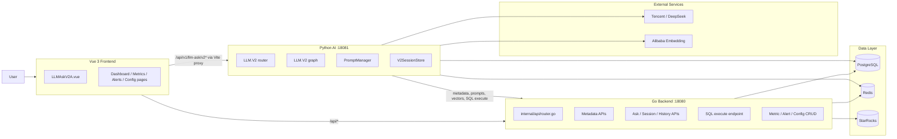
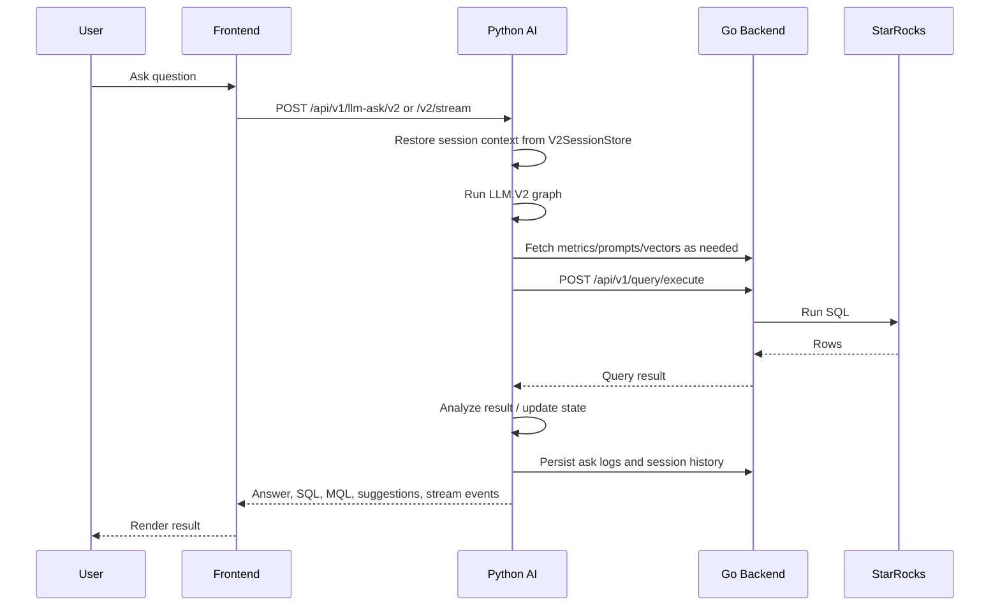
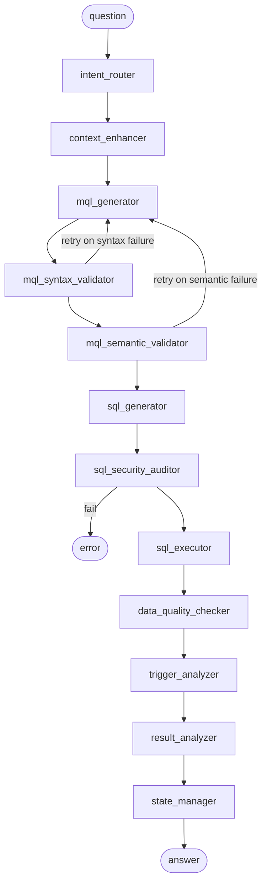

# Dev Metric Architecture

Updated: 2026-04-30

This document describes the current runtime architecture of `dev_metric` based on the code that is actually wired today. It replaces earlier high-level notes that drifted from the implementation.

## 1. System Overview

`dev_metric` is a metric management and intelligent analytics platform with three active runtime surfaces:

- A Vue 3 frontend for dashboards, metric management, alerting, and AI ask flows.
- A Go Gin backend that owns auth, CRUD APIs, metadata APIs, SQL execution, and most persistence-facing endpoints.
- A Python FastAPI AI service that owns the active `LLM.V2` NL2SQL / analysis pipeline.

At a high level:

- The frontend talks to Go for most APIs.
- The frontend talks to Python AI for `LLM.V2` ask endpoints during local development through a Vite proxy.
- Python AI depends on Go metadata/query endpoints to fetch metric definitions, prompt configs, vectors, and execute SQL against StarRocks.

## 2. Runtime Ports

| Surface | Default / configured port | Source of truth | Notes |
|---|---:|---|---|
| Go backend | `18080` | `config.yaml`, `cmd/server/main.go` | Health, metadata, CRUD, query execution |
| Python AI | `18081` | `.env`, `ai/config/runtime.py` | Active `LLM.V2` service |
| Frontend dev server | `3002` | `web/vite.config.js` | Can be overridden at startup; this session was run on `3001` |
| PostgreSQL | `5432` | `config.yaml` | Config/prompt/metadata store |
| Redis | `6379` | `config.yaml`, `ai/config/runtime.py` | Cache and `LLM.V2` session durability |
| StarRocks | `6033` app config / query path | `config.yaml` | Business data warehouse |

## 3. Top-Level Component Map

## 4. Frontend Architecture

Frontend routing is defined in `web/src/router/index.js`.

Important pages:

- `/llm-ask-v2`: main AI ask UI, implemented by `LLMAskV2A.vue`
- `/dashboard`
- `/metrics`
- `/alerts`
- `/analysis`
- `/config-center`

Vite development proxy:

- `/api/v1/llm-ask/v2*` is proxied to Python AI on `18081`
- all other `/api/*` routes are proxied to Go on `18080`

This split is important because:

- active `LLM.V2` request/stream handling runs in Python
- session history, dashboard data, metadata, and config surfaces still live in Go

## 5. Go Backend Architecture

Entrypoint:

- `cmd/server/main.go`

Boot sequence:

1. load `config.yaml`
2. initialize logging
3. initialize Redis cache
4. initialize StarRocks repository
5. initialize PostgreSQL asynchronously
6. build Gin router
7. seed formula syntax configs in the background after DB init
8. serve on `cfg.App.Host:cfg.App.Port`

Key responsibilities:

- health endpoints: `/health`, `/health/ready`, `/health/live`
- auth + middleware
- metrics CRUD and import/export
- alert rule CRUD
- metadata APIs consumed by Python AI
- SQL execution endpoint used by Python AI
- prompt config APIs used by `PromptManager`
- ask session/history persistence APIs

Important route groups in `internal/api/router.go`:

- `/api/v1/metrics`
- `/api/v1/alerts`
- `/api/v1/dashboard`
- `/api/v1/ask`
- `/api/v1/llm-ask`
- `/api/v1/analysis`
- `/api/v1/metadata`
- `/api/v1/llm`
- `/api/v1/nlp`
- `/api/v1/query`
- `/api/v1/prompt-configs`

## 6. Python AI Architecture

Entrypoint:

- `ai/main.py`

Important facts from the current code:

- the legacy `/api/v1/ask` endpoint is deprecated
- active production logic is `LLM.V2`
- startup loads semantic vectors
- AI runtime reads `.env` through `ai/config/runtime.py`

Major submodules:

- `ai/engine/llm_v2/`: active ask pipeline
- `ai/analysis/`: analysis agent / template matching
- `ai/client/`: Go metadata/query clients
- `ai/feedback/`: ask feedback analysis
- `ai/services/`: dimension services
- `ai/ner/`: entity extraction helpers

## 7. LLM.V2 Request Flow

Active router:

- `ai/engine/llm_v2/router.py`

The non-streaming endpoint is `/api/v1/llm-ask/v2`.
The streaming endpoint is `/api/v1/llm-ask/v2/stream`.

End-to-end sequence:

## 8. LLM.V2 Graph

Current graph implementation lives in `ai/engine/llm_v2/graph.py`.

Core nodes:

1. `intent_router`
2. `context_enhancer`
3. `mql_generator`
4. `mql_syntax_validator`
5. `mql_semantic_validator`
6. `sql_generator`
7. `sql_security_auditor`
8. `sql_executor`
9. `data_quality_checker`
10. `trigger_analyzer`
11. `result_analyzer`
12. `state_manager`

The docs and code often call this an "11-step" flow, but the active implementation includes the trigger-analysis stage before result generation.

## 9. Intent and Follow-Up Model

`intent_router.py` currently combines:

- greeting / short follow-up detection
- local model first-pass recognition
- dimension follow-up handling
- comparison follow-up handling
- add-metric follow-up handling
- fallback to LLM intent recognition

Recent behavior that now matters:

- add-metric follow-ups such as `增加毛利` are resolved through `MetricClient` and synonym-aware lookup, not only through hardcoded metric keywords
- this path uses a dedicated source marker so `mql_generator` does not collapse the follow-up back into a single metric

## 10. MQL and SQL Generation

Data model:

- `ai/engine/llm_v2/schema.py`

Important `MQLSchema` fields:

- `metric`: primary metric
- `metrics`: additional metrics for multi-metric queries
- `time`
- `dimensions`
- `filters`
- `comparison`
- `cross_metric`

SQL generation:

- `ai/engine/llm_v2/nodes/sql_generator.py`

Important behavior:

- default table is `ids.IDS_AMZ_COMPREHENSIVE_DI`
- dimensions are mapped through config-backed dimension mappings
- multi-metric SQL is built by appending additional metric expressions from `mql.metrics`
- YoY / MoM use dedicated conditional-aggregation SQL builders
- order-by and limit are applied deterministically

## 11. Session, State, and Cache Model

Current durable session model:

- `V2SessionStore` in `ai/engine/llm_v2/session_store.py`
- Redis first
- in-process memory fallback if Redis is unavailable

Persisted durable fields:

- latest MQL
- history stack
- conversation summary
- user id
- timestamps

Current state model:

- `V2State` in `schema.py`

Internal state that is now first-class on `V2State`:

- `session_state`
- `multi_metric_mode`
- `drilldown_category`
- `conversation_summary`

`ContextScope` is now intentionally narrower and mainly holds cross-node user-visible context:

- `clarification_message`
- `clarification_options`
- `similar_cases`
- `suggestions`
- `drilldown_type`
- `comparison_results`

Supporting caches:

- `PromptManager`: Redis + DB + memory fallback
- `MQLSQLCache`: L1 memory + L2 Redis
- semantic vectors loaded at AI startup

## 12. Data Dependencies

PostgreSQL stores:

- metric definitions
- business terms / synonyms
- dimension configs
- prompt configs
- feedback and session history

StarRocks stores:

- business fact data queried by generated SQL

Redis stores:

- Go-side cache
- AI prompt cache
- `LLM.V2` durable session state
- SQL cache layers

## 13. Known Gaps and Drift

Current known gaps worth tracking:

- some older docs still refer to ports `8080/8081`; active configured services are `18080/18081`
- the root-level legacy AI entrypoints remain in the repo but are deprecated
- semantic startup still logs a missing `dim_value_embeddings` relation in PostgreSQL
- old skipped tests still describe removed `legacy_engine` / `langgraph_engine` paths

## 14. Recommended Reader Map

If you need to understand the system quickly, read in this order:

1. `cmd/server/main.go`
2. `internal/api/router.go`
3. `ai/main.py`
4. `ai/engine/llm_v2/router.py`
5. `ai/engine/llm_v2/graph.py`
6. `ai/engine/llm_v2/nodes/intent_router.py`
7. `ai/engine/llm_v2/nodes/sql_generator.py`
8. `ai/engine/llm_v2/session_store.py`
9. `web/src/router/index.js`
10. `web/src/views/LLMAskV2A.vue`
