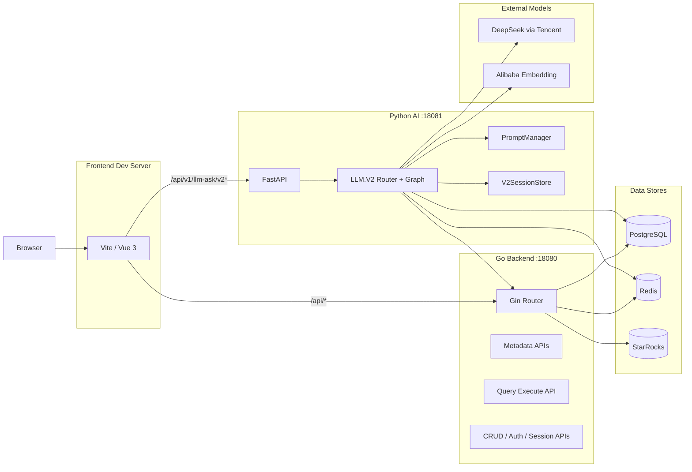
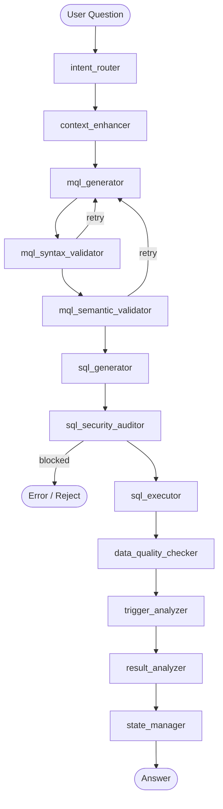
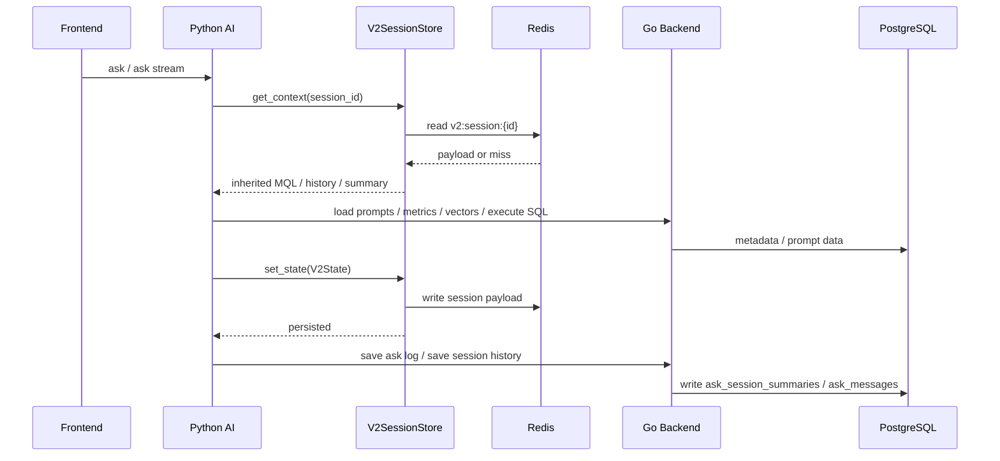

# System Architecture Diagrams

Updated: 2026-04-30

This file is the diagram-only companion to `docs/PROJECT_ARCHITECTURE.md`.

## 1. Deployment View



## 2. LLM.V2 Pipeline



## 3. Session and Cache Flow



## 4. Frontend Routing and Proxy

```mermaid
flowchart LR
    AskPage[/llm-ask-v2]
    OtherPages[/dashboard /metrics /alerts /analysis /config-center]

    AskPage -->|axios / SSE| ProxyLLM[/api/v1/llm-ask/v2*]
    OtherPages -->|axios| ProxyAPI[/api/*]

    ProxyLLM --> PY[Python AI :18081]
    ProxyAPI --> GO[Go Backend :18080]
```
